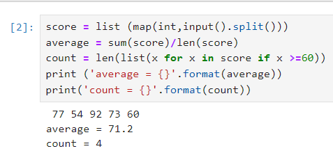

# 南華大學Python程式設計-期末報告
11124112 林郁翔
# 第二題
統計學生平均成績與及人數
# 描述
寫一個程式，計算學生們的平均成績，並統計及格(成績不低於60分)的人數。
# 輸入格式
在一行中給出n個非負整數，即這n位學生的成績，期間以空格分離。
# 輸出格式
按照以下程式輸出:

average = 成績均值

count = 及格人數

# 程式碼:
## 通過map()及list()函數把用戶輸入轉化成int列表
score = list (map(int,input().split()))
## 用總和除以數量得到平均分
average = sum(score)/len(score)
## 通過列表推倒式得到大於60分的列表然後用len()函數得到數量
count = len(list(x for x in score if x >=60))
## 輸出
print ('average = {}'.format(average))

print('count = {}'.format(count))
# 程式截圖

